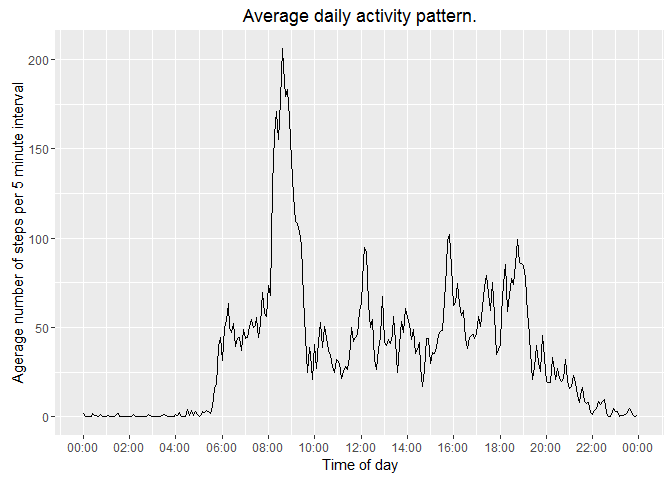
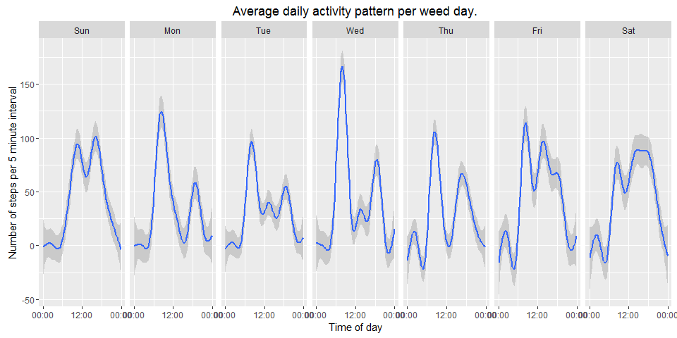

# Reproducible Research: Peer Assessment 1

## Loading required libraries

```r
#Check and install libraries if neccessary
if(!"dplyr" %in% rownames(installed.packages()))
        install.packages("dplyr")
library(dplyr)
if(!"lubridate" %in% rownames(installed.packages()))
        install.packages("lubridate")
library(lubridate)
if(!"ggplot2" %in% rownames(installed.packages()))
        install.packages("ggplot2")
library(ggplot2)
if(!"stringr" %in% rownames(installed.packages()))
        install.packages("stringr")
library(stringr)
if(!"scales" %in% rownames(installed.packages()))
        install.packages("scales")
library(scales)
library(knitr)
```

## Loading and preprocessing the data
Downloading data from [course web site]('https://d396qusza40orc.cloudfront.net/repdata%2Fdata%2Factivity.zip) and loading it.  


```r
if(!file.exists("activity.csv")){
        if(!file.exists("repdata_data_activity.zip")) #check if original file is already downloaded
        {
                download.file('https://d396qusza40orc.cloudfront.net/repdata%2Fdata%2Factivity.zip', 
                                "repdata_data_activity.zip", 
                                mode = "wb")
        }
        unzip("repdata_data_activity.zip")
}

activityData <- read.csv("activity.csv",sep=",", na.strings = "NA", stringsAsFactors = FALSE, 
                       colClasses = c("numeric","character","character"))
activityData <- activityData %>%
        mutate(
                date=ymd(date), #conert text to date
                interval=str_pad(interval,4,pad="0"), #add leading zeroes to interval (hours or minutes)
                interval=sub( '(?<=.{2})', ':', interval, perl=TRUE ), #insert separator between hours and minutes
                #interval=parse_date_time(interval,"hm")
                interval = as.POSIXct(interval, format='%H:%M',tz="UTC"),
                weekDay = factor(as.POSIXlt(date)[["wday"]],labels=c("Sun","Mon","Tue","Wed","Thu","Fri","Sat"))
                )
```

## What is mean total number of steps taken per day?

```r
#summarize total number of steps per day
activitySummary<-activityData %>% group_by(date,weekDay) %>% summarize(totalSteps=sum(steps),numNA=sum(is.na(steps)))

#draw histogramm
ggplot(data=activitySummary, aes(totalSteps)) + geom_histogram(binwidth=1000) + ggtitle("Histogram of total number of steps per day")
```

 

```r
options(scipen = 6) #set number of digits that can be printed before switching to scientific notation.
meanTotalSteps<- round(mean(activitySummary$totalSteps,na.rm=TRUE),2)
medianTotalSteps<-median(activitySummary$totalSteps,na.rm=TRUE)
```

Mean total number of steps taken per day is 10766.19.
Median total number of steps taken per day is 10765.


## What is the average daily activity pattern?

```r
intervalActivitySummary<-activityData %>% group_by(interval) %>% summarize(avgSteps=mean(steps,na.rm=TRUE), numNA=sum(is.na(steps)))

ggplot(data = intervalActivitySummary, aes(interval,avgSteps)) +
        geom_line()+ 
        scale_x_datetime(breaks = date_breaks("120 mins"), labels = date_format("%H:%M")) +
        ylab("Agerage number of steps per 5 minute interval") +
        xlab("Time of day")
```

 

```r
maxAvgSteps<-max(intervalActivitySummary$avgSteps) # get peak avgSteps value
maxAvgStepsInterval<-intervalActivitySummary %>% filter(avgSteps==maxAvgSteps) #find peak interval
periodStart<-format(maxAvgStepsInterval$interval,'%H:%M') #get start of period
periodEnd<-format(maxAvgStepsInterval$interval+300,'%H:%M') #calculate end of period
```

The maximum number of steps is in the interval between 08:35 and 08:40.  

## Imputing missing values

```r
totalMissing<-nrow(activityData %>% filter(is.na(steps)))
```
The total number of missing values is 2304 (out of 17568).
Let's see how missing values are distributed among the dates.


```r
weekDayActivitySummary<-activityData %>% 
        filter(is.na(steps)==TRUE) %>% 
        group_by(date,weekDay) %>%
        summarize(numNA=sum(is.na(steps)))
kable(weekDayActivitySummary)
```


date         weekDay    numNA
-----------  --------  ------
2012-10-01   Mon          288
2012-10-08   Mon          288
2012-11-01   Thu          288
2012-11-04   Sun          288
2012-11-09   Fri          288
2012-11-10   Sat          288
2012-11-14   Wed          288
2012-11-30   Fri          288

As we can see there are a number of days when all 288 records are missing. That means that average over interval will be fair. 
Moreover, there are no particular days of week when too many values are missing. Let's see if we need to take weekday into account. Let's see if moving pattern differs among the week days.  

```r
filteredData<-activityData%>%filter(!is.na(steps))

ggplot(data = filteredData, aes(interval,steps)) +
        geom_smooth()+ 
        facet_grid(.~weekDay)+
        scale_x_datetime(breaks = date_breaks("720 mins"), labels = date_format("%H:%M")) +
        ylab("Number of steps per 5 minute interval") +
        xlab("Time of day")
```

 

As we see, Friday, Saturday and Sunday have somewhat similar pattern, that differs significantly from other days.
So, let's average missing values on per interval, per weekday basis.

```r
theAverages<-filteredData %>% group_by(interval,weekDay) %>% summarize(avgSteps=round(mean(steps)))%>%ungroup()
getCorrectAverage<-function(naRow,theAverages)
{
        if(is.na(naRow[1,"steps"]))
        {
                test<-theAverages %>% filter(interval==naRow[1,"interval"], weekDay==naRow[1,"weekDay"])%>%select(avgSteps)
                as.numeric(test["avgSteps"])
        }else 
        naRow[1,"steps"]
}
filledActivityData<-activityData
for(i in c(1:nrow(activityData)))
{
        filledActivityData$steps[i]<-getCorrectAverage(activityData[i,],theAverages)
}
```


### What is the new mean total number of steps taken per day?

```r
#summarize total number of steps per day
activitySummary<-filledActivityData %>% group_by(date,weekDay) %>% summarize(totalSteps=sum(steps),numNA=sum(is.na(steps)))

#draw histogramm
ggplot(data=activitySummary, aes(totalSteps)) + geom_histogram(binwidth=1000) + ggtitle("Histogram of total number of steps per day")
```

 

```r
options(scipen = 6) #set number of digits that can be printed before switching to scientific notation.
meanTotalSteps<- round(mean(activitySummary$totalSteps,na.rm=TRUE),2)
medianTotalSteps<-median(activitySummary$totalSteps,na.rm=TRUE)
```

New mean total number of steps taken per day is 10821.1.
New median total number of steps taken per day is 11015.

As we see, the average and median of the total number of steps per day increased over the initial measurement.

## Are there differences in activity patterns between weekdays and weekends?

```r
filledActivityData<-filledActivityData %>% mutate(is_weekend=as.numeric(weekDay=='Sat'|weekDay=='Sun'),is_weekend=factor(is_weekend,labels=c("weekend","weekday")))

intervalActivitySummary<-filledActivityData %>% group_by(interval, is_weekend) %>% summarize(avgSteps=mean(steps,na.rm=TRUE), numNA=sum(is.na(steps)))

ggplot(data = intervalActivitySummary, aes(interval,avgSteps)) +
        geom_line()+ 
        facet_grid(is_weekend~.)+
        scale_x_datetime(breaks = date_breaks("120 mins"), labels = date_format("%H:%M")) +
        ylab("Agerage number of steps per 5 minute interval") +
        xlab("Time of day") +
        ggtitle("Number of steps on weekends vs weekdays")
```

 

